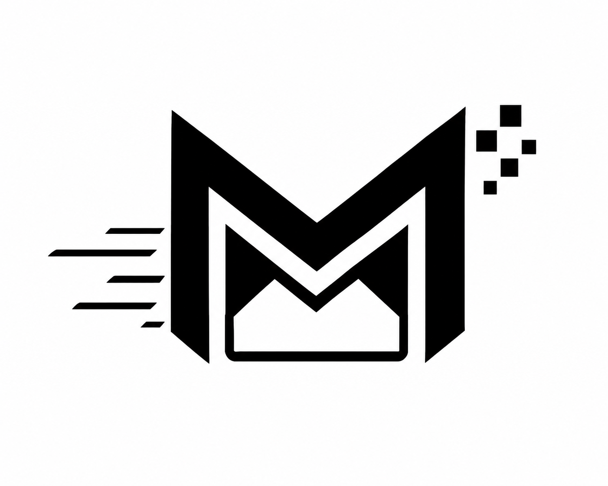

<p align="center">
  
</p>

<h1 align="center">MAILMIND AI</h1>
<p align="center"><i>The Next Evolution of Intelligent Email Management</i></p>

<p align="center">
  
  
</p>

<p align="center">
  <a href="https://reactjs.org/"></a>
  <a href="https://www.typescriptlang.org/"></a>
  <a href="https://nodejs.org/"></a>
  <a href="https://www.mongodb.com/"></a>
  <a href="https://openrouter.ai/"></a>
</p>

MailMind AI is a professional-grade, AI-powered email assistant designed to streamline your communication workflow. By leveraging advanced Large Language Models (Gemma 2 27B), it transforms your inbox from a static list of messages into a dynamic command center.

---


MailMind AI is built to solve the modern crisis of **"Inbox Overload."** Instead of spending hours reading through long threads and manually drafting repetitive replies, MailMind AI acts as your intelligent executive assistant.

Developed through multiple **Agile Sprints**, the platform was designed with a focus on speed, precision, and privacy. The project uses a **Brutalist-Modern design language** that strips away unnecessary clutter, providing a high-performance experience even on low-end mobile devices. By connecting directly to the Gmail and Google Calendar APIs, it creates a seamless bridge between your conversations and your schedule.

---


| Feature                     | Description                                                                           |
| :-------------------------- | :------------------------------------------------------------------------------------ |
| **🧠 Smart Summarization**  | Instantly distill long threads into 3 actionable bullet points.                       |
| **✉️ Intent-Based Replies** | Generate professional, polite, or direct replies with a single click.                 |
| **📅 Auto-Scheduling**      | Automatically detects meeting requests and generates one-click Google Calendar links. |
| **🔔 Live Notifications**   | Real-time polling for new messages and AI background processing alerts.               |
| **📱 Cross-Platform**       | Fully responsive design optimized for Mobile, Tablet, and Desktop views.              |

---


This project was developed using **Agile best practices**, ensuring continuous improvement through iterative cycles and feedback loops.

### 🏃‍♂️ Sprints & Iterations

#### **Sprint 1: The Foundation**

- **Goal**: Establish core infrastructure and OAuth security.
- **Outcome**: Implemented Google OAuth 2.0 flow, MongoDB user storage, and the Brutalist-Modern UI framework.

#### **Sprint 2: Intelligence Integration**

- **Goal**: Connect the AI engine and Gmail services.
- **Outcome**: Integrated OpenRouter API (Gemma 2), built the Gmail inbox crawler, and implemented the AI Action Panel.

#### **Sprint 3: UX Refinement & Polish**

- **Goal**: Finalize responsiveness and performance.
- **Outcome**: Optimized for low-end mobile devices (Samsung M11), implemented Tablet Drawer logic, and added the Live Notification Hub.

---


### **Frontend**

- **React 18** + **Vite** (Next-gen bundling)
- **TypeScript** (Type-safe development)
- **Framer Motion** (High-end scroll-linked animations)
- **Tailwind CSS** (Utility-first styling)
- **Lucide Icons** (Vector-perfect iconography)

### **Backend**

- **Node.js** + **Express**
- **MongoDB** (User session & AI history storage)
- **Google APIs** (Gmail & Calendar integration)
- **JWT** (Secure stateless authentication)
- **Helmet & Rate Limiter** (Security firewall)

---


### **Prerequisites**

- Node.js (v18+)
- MongoDB Atlas account
- Google Cloud Console Project (with Gmail & Calendar APIs enabled)

### **Installation**

1. **Clone the Repository**

   ```bash
   git clone https://github.com/VARA4u-tech/MAIL-MIND-AI.git
   cd mail-mind-ai
   ```

2. **Backend Setup**

   ```bash
   cd backend
   npm install
   # Configure your .env file with MongoDB and Google Credentials
   npm run dev
   ```

3. **Frontend Setup**
   ```bash
   cd ../frontend
   npm install
   npm run dev
   ```

---


```text
mail-mind-ai/
├── backend/
│   ├── config/         # Database & Auth configurations
│   ├── controllers/    # Business logic (AI, Gmail, Auth)
│   ├── models/         # MongoDB Schemas
│   └── routes/         # API Endpoints
└── frontend/
    ├── src/
    │   ├── components/ # Reusable UI Modules
    │   ├── pages/      # Dashboard & Landing layouts
    │   └── assets/     # Branding & Media
```

---


- **Firewall Enabled**: Rate limiting and Helmet.js headers protect against brute-force and XSS.
- **Mobile Optimized**: Disables heavy animations and backdrop-blurs on low-power mobile devices to ensure smooth scrolling.
- **Stateless Auth**: Uses secure JWT tokens passed via Authorization headers.

---


<h2 align="center" style="color:#ff1a1a; letter-spacing:2px;">
  COOKED & SERVED BY VARA
</h2>
