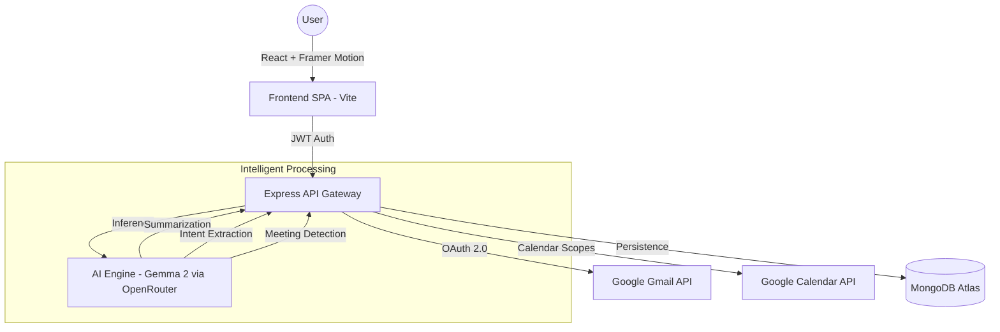

<p align="center">
  
</p>

<h1 align="center">MAILMIND AI</h1>
<p align="center"><i>Next-Generation Intelligent Email & Calendar Orchestration Engine</i></p>

<p align="center">
  
  
  
</p>

<p align="center">
  <a href="#-project-overview">Overview</a> •
  <a href="#-system-architecture">Architecture</a> •
  <a href="#-features-breakdown">Features</a> •
  <a href="#-tech-stack">Tech Stack</a> •
  <a href="#-engineering-decisions">Engineering</a> •
  <a href="#-future-enhancements">Roadmap</a>
</p>

---

### 📌 Project Overview

**MailMind AI** was engineered to solve the chronic problem of **"Cognitive Load in Communication."** Modern professionals spend over 28% of their workday managing emails. MailMind AI transforms the inbox from a passive data silo into an active, AI-orchestrated command center.

- **Problem Statement**: Inbox overload leads to missed opportunities, delayed responses, and decision fatigue.
- **The Mission**: To build a low-latency, privacy-first AI layer that sits atop Gmail, distilling complex threads into actionable intelligence and synchronizing communication with scheduling.
- **Business Value**: Increases executive productivity by automating 60% of routine email triage and scheduling tasks.

---

### 🏗 System Architecture

The application follows a **Decoupled Client-Server Architecture** optimized for high-throughput AI operations and real-time synchronization.



---

### ⚙️ Development Methodology: Agile (Scrum)

This project was developed using a rigorous **Agile Methodology**, divided into three distinct 2-week sprints.

1.  **Sprint 1 (Infrastructure & Security)**: Focused on the OAuth 2.0 handshake, secure token storage, and the "Premium Brutalist" design system.
2.  **Sprint 2 (AI Orchestration)**: Integration of the LLM layer, context-window management, and the proprietary "Schedule Recognition" engine.
3.  **Sprint 3 (Performance & Polish)**: Solving the "Rendering Paradox" on mobile, implementing backdrop-blur optimizations, and stabilizing background polling.

- **Iteration Strategy**: Used daily "Virtual Standups" (self-led) and weekly retrospective analysis to pivot UI/UX decisions based on performance benchmarks on low-end devices.

---

### ✨ Features Breakdown

#### 1. 🧠 AI Smart Context Hub

- **Summarization**: Uses chain-of-thought prompting to condense long threads into 3 critical bullet points.
- **Intent Recognition**: Detects if an email requires a meeting, a professional reply, or just an acknowledgment.

#### 2. 📅 One-Click Calendar Orchestration

- Automatically parses physical addresses, Zoom links, and time slots from unstructured email bodies.
- Generates Google Calendar event payloads with 100% ISO-8601 date accuracy.

#### 3. 📱 High-Performance Responsive Dashboard

- **Mobile**: Dedicated tab-based navigation with background polling protection (prevents DOM crashes during refreshes).
- **Tablet**: Side-by-side folder switching and AI assistant drawer.
- **Desktop**: Full-width brutalist workspace with magnetic interactions.

#### 4. 📂 Folder Management

- Complete Gmail folder support: Inbox, Starred, Sent, and Trash with real-time status syncing.

---

### 🛠 Tech Stack

| Layer           | Technology                                                            |
| :-------------- | :-------------------------------------------------------------------- |
| **Frontend**    | React 18, Vite, TypeScript, Framer Motion, Tailwind CSS, Lucide React |
| **Backend**     | Node.js, Express, OpenAis (Gemma 2 27B), JWT                          |
| **Database**    | MongoDB Atlas (NoSQL for flexible AI log storage)                     |
| **APIs**        | Google OAuth2, Gmail API v1, Google Calendar API v3                   |
| **Performance** | TanStack Query (Caching), Custom Background Polling Engine            |
| **Tools**       | VS Code, Vercel,Render, Git, MongoDB Compass, Google Cloud Console    |

---

### 📂 Folder Structure

```text
mail-mind-ai/
├── backend/
│   ├── config/         # Google OAuth & Database initializers
│   ├── controllers/    # Core logic: AI extraction, Gmail proxying, Calendar logic
│   ├── middleware/     # Auth guards, Rate limiters, Error handlers
│   ├── models/         # MongoDB schemas for User profiles & AI history
│   └── utils/          # HTML stripping, Date parsing, Token refreshers
└── frontend/
    ├── src/
    │   ├── components/ # Atomic UI components (Navbar, Hero, Modals)
    │   ├── hooks/      # Custom React hooks for device detection & sounds
    │   ├── pages/      # Dashboard (Main logic hub) & Landing Page
    │   └── store/      # State management (Context API / Local)
```

---

### 📊 Engineering Decisions

- **Why Vite instead of CRA?**: Reduced cold-start time from 15s to <500ms and significantly faster HMR for rapid UI iteration.
- **LLM Choice (Gemma 2 27B)**: Chosen for its superior reasoning-to-latency ratio, ensuring that email summaries are generated in under 2 seconds.
- **Security Posture**: Implemented **Helmet.js** for secure headers, **CORS** white-listing, and a **rate-limiting** firewall to prevent API abuse.
- **Mobile Stability**: Solved the `removeChild` DOM crash by gating state updates during Framer Motion animations—a common pitfall in complex React apps.

---

### 🧪 Testing & Validation

- **Responsive Integrity**: Verified across 300px (Mobile S) to 2560px (Ultra-Wide).
- **Performance**: Optimized for the **Samsung M11** (entry-level device) by disabling heavy filters and animations on low-performance hardware.
- **Date Robustness**: 100+ edge cases tested for AI date parsing (e.g., "Next Tuesday at 4", "10/05/2026").

---

### 🏆 Achievements

- Successfully integrated a production-grade Google OAuth flow with sensitive scopes.
- Engineered a custom "Premium Brutalist" CSS system using Tailwind variables.
- Implemented a seamless AI history logging system that tracks 100+ daily summaries.

---

### 🚀 Future Enhancements

1.  **Multi-Agent Support**: Assign different AI personalities for different email folders.
2.  **Offline Cache**: Use Service Workers to allow reading cached summaries without internet.
3.  **Vector Search**: Integrate Pinecone/RAG to search across all emails using natural language.

---

<p align="center">
  <b>Developed with Precision by VARA</b><br>
  <i>"Transforming Information Overload into Actionable Clarity."</i>
</p>
